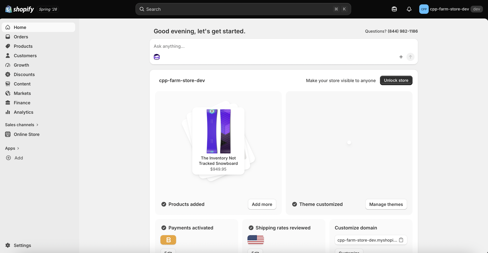
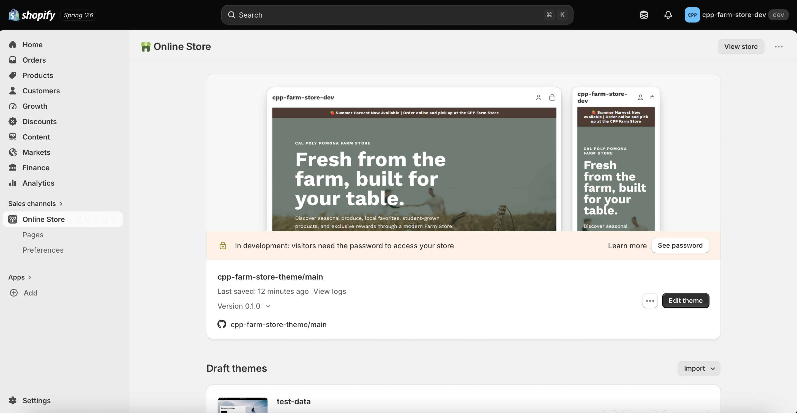
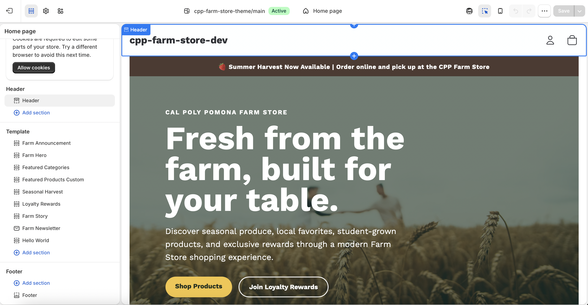

# Store Name and Concept

## Store Name

CPP Farm Store

## Store Concept

The CPP Farm Store is an online specialty retail store that offers fresh produce, locally sourced food products, baked goods, specialty grocery items, customizable gift baskets, and Cal Poly Pomona branded merchandise. The online store extends the Farm Store's physical presence by allowing customers to browse products and place orders online while supporting the university's agricultural programs.

# Target Customer

The target customers include Cal Poly Pomona students, faculty, staff, alumni, local residents, and families who value fresh produce, locally sourced products, and specialty foods. Customers are also interested in supporting university agriculture programs and purchasing unique gift items that are not commonly available at traditional grocery stores.

# Product Category Plan

The store will include the following product categories:

-   Fresh Produce
-   Bakery & Baked Goods
-   Specialty Grocery
-   Gift Baskets
-   CPP Merchandise

# Initial Shopify Setup Evidence

## Shopify Admin

## Selected Theme

## Homepage Draft

# Connection to CPP Farm Store

Developing the Shopify store helped me better understand how products are organized for online retailing and how customers navigate an e-commerce website. Organizing products into categories, selecting a theme, and designing the homepage provided insight into online merchandising and customer experience. These activities also supported the CPP Farm Store consulting project by demonstrating how Shopify can improve product visibility, customer engagement, and omnichannel retail operations.

# Appendix

## GitHub Page

To be added after publishing to GitHub Pages.

## GitHub Repository

To be added after publishing to GitHub.
